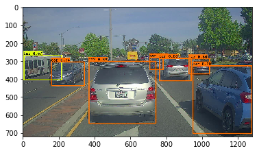

# Car detection with YOLOv2

# Goal
- Use object detection on a car detection dataset
- Deal with bounding boxes

# File Description
- `.ipynb` file is the solution of Week 3 program assignment 1
  - Autonomous+driving+application+-+Car+detection+-+v1.ipynb
- `.html` file is the html version of `.ipynb` file.
  - Autonomous+driving+application+-+Car+detection+-+v1.html
- `.py` file
  - Autonomous+driving+application+-+Car+detection+-+v1.py
- file
  - Autonomous+driving+application+-+Car+detection+-+v1.md
  
# Snapshot
- **Recommend** read `.ipynb` file via [nbviewer](https://nbviewer.jupyter.org/)
- computer view. open .html file via brower for quick look.
- brower view Autonomous+driving+application+-+Car+detection+-+v1.md

# Implementation
- Filtering with a threshold on class scores
- Non-max suppression

# Summary for YOLO
- Input image (608, 608, 3)
- The input image goes through a CNN, resulting in a (19,19,5,85) dimensional output.
- After flattening the last two dimensions, the output is a volume of shape (19, 19, 425):
  - Each cell in a 19x19 grid over the input image gives 425 numbers.
  - 425 = 5 x 85 because each cell contains predictions for 5 boxes, corresponding to 5 anchor boxes, as seen in lecture.
  - 85 = 5 + 80 where 5 is because  (pc,bx,by,bh,bw)(pc,bx,by,bh,bw)  has 5 numbers, and and 80 is the number of classes we'd like to detect
- You then select only few boxes based on:
  - Score-thresholding: throw away boxes that have detected a class with a score less than the threshold
  - Non-max suppression: Compute the Intersection over Union and avoid selecting overlapping boxes
- This gives you YOLO's final output.

# What you should remember from this notebook:
- YOLO is a state-of-the-art object detection model that is fast and accurate
- It runs an input image through a CNN which outputs a 19x19x5x85 dimensional volume.
- The encoding can be seen as a grid where each of the 19x19 cells contains information about 5 boxes.
- You filter through all the boxes using non-max suppression. Specifically:
  - Score thresholding on the probability of detecting a class to keep only accurate (high probability) boxes
  - Intersection over Union (IoU) thresholding to eliminate overlapping boxes
- Because training a YOLO model from randomly initialized weights is non-trivial and requires a large dataset as well as lot of computation, we used previously trained model parameters in this exercise. If you wish, you can also try fine-tuning the YOLO model with your own dataset, though this would be a fairly non-trivial exercise.

# References
The ideas presented in this notebook came primarily from the two YOLO papers. The implementation here also took significant inspiration and used many components from Allan Zelener's github repository. The pretrained weights used in this exercise came from the official YOLO website.
- Joseph Redmon, Santosh Divvala, Ross Girshick, Ali Farhadi - [You Only Look Once: Unified, Real-Time Object Detection (2015)](https://arxiv.org/abs/1506.02640)
- Joseph Redmon, Ali Farhadi - [YOLO9000: Better, Faster, Stronger (2016)](https://arxiv.org/abs/1612.08242)
- Allan Zelener - [YAD2K: Yet Another Darknet 2 Keras](https://github.com/allanzelener/YAD2K)
- The official YOLO website (https://pjreddie.com/darknet/yolo/)
